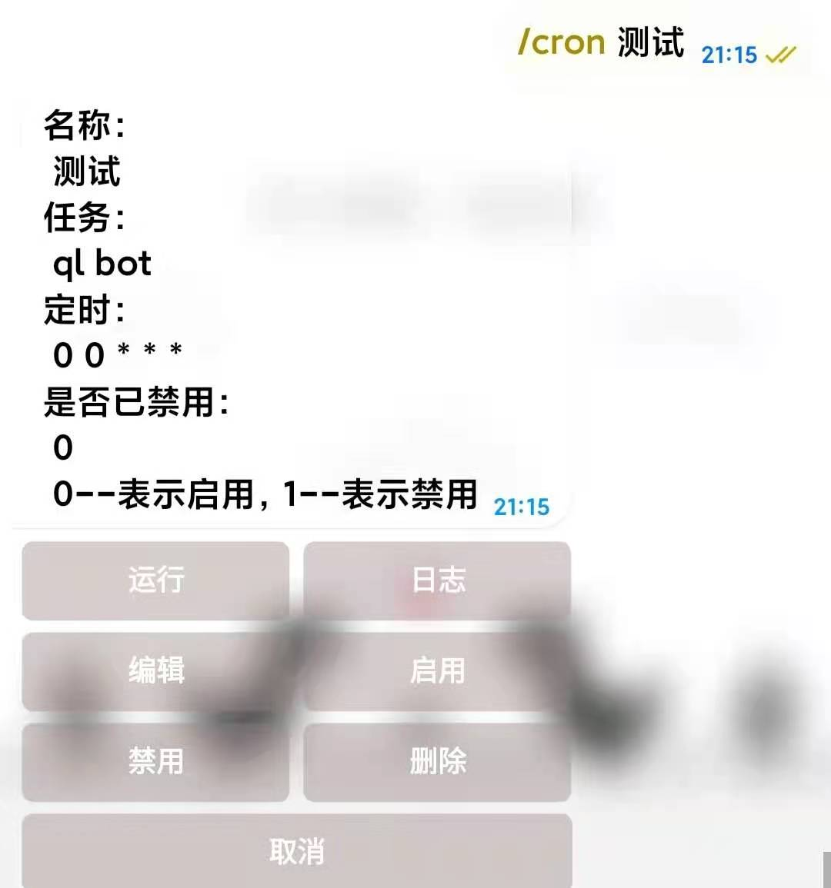
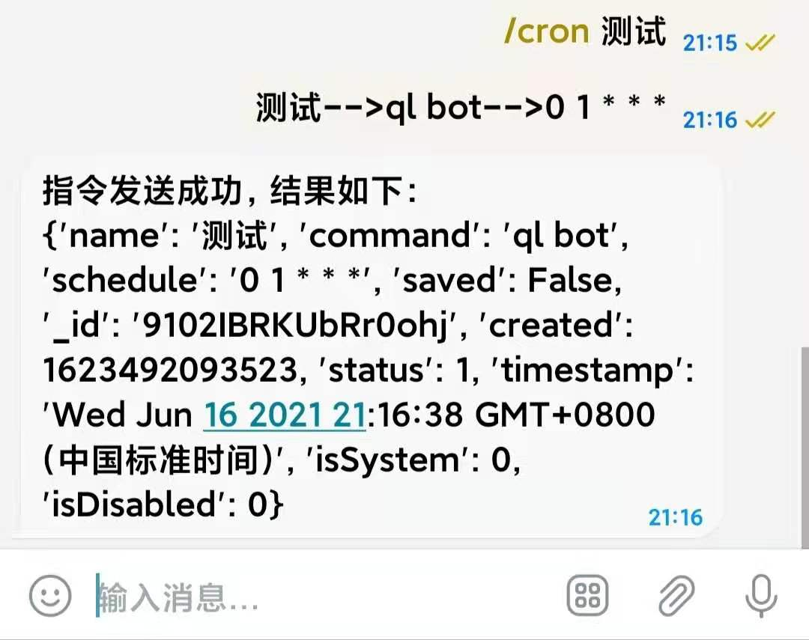

# cron 命令使用方法

/cron 命令主要用来管理日常定时任务，具体使用方法为`/cron keywords`
例如`/cron 测试`会找到命令内包含测试字符的命令
可以管理所有的定时任务，包含`repo raw task`等等

点击按钮即可进行命令管理，主要包含**运行，编辑，启用，禁用，删除**等命令

点击相应按钮即可执行相应操作，以编辑为例

提示复制信息修改，此时点击上方信息即可复制。(只要提示复制信息修改的，都可点击进行复制，无需长按复制)
复制后在输入框内输入并修改后发送给机器人，机器人会给你包含返回信息

---

More...
